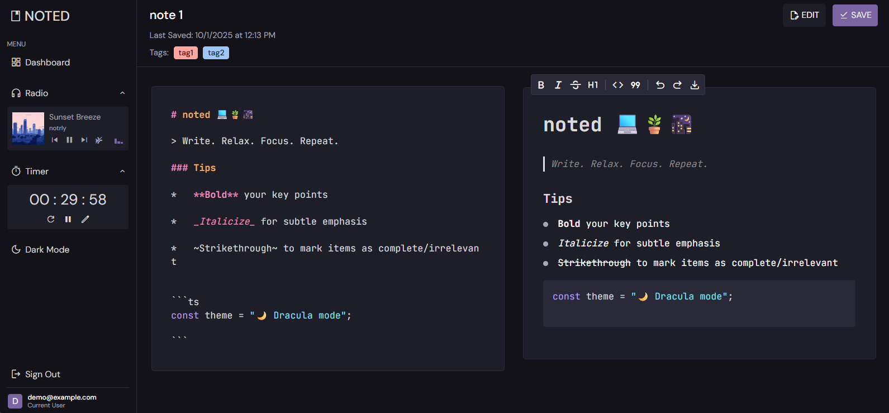

# noted 

An all-in-one workspace that provides a dual-mode (Markdown or WYSIWYG) text editor, lofi music, and focus tools to keep you in the productivity zone. 

Built with [Next.js](https://nextjs.org/) & [Supabase](https://supabase.com/), styled with [Tailwind](https://tailwindcss.com/), and deployed on [Vercel](https://vercel.com/).

[Check it out!](https://noted-lofi.vercel.app/) - Click `Use Open Editor` to start editing instantly (no signup required).
 

## Features
A quick look at what noted can do:
- **📝 Dual Editor** - Edit notes your way — raw Markdown or rich-text — whichever suits your flow. 
- **💾 Auto-Saving** - With all changes being stored in real-time, never stress about losing progress.
- **🗂️ Export as PDF** - Print, save, or share your notes as a PDF with one simple click.
- **🔖 Categorize with Tags** - Keep your notes organized by labeling them with any number of tags.
- **⏲️ Pomodoro Timer** - Stay focused and distraction-free with a built-in session timer. 
- **🎧 Radio | ATC** - Combine lofi tracks (courtesy of [SoundCloud](https://soundcloud.com/)) with ATC chatter for the ultimate cozy workspace.

